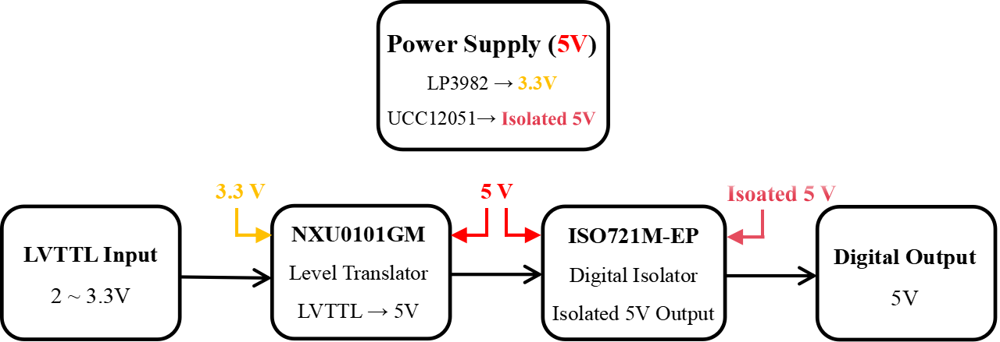

# 4-Channel LVTTL to 5V Digital Level Shifter with Isolation and Protection

## Overview
This repository describes the operation and circuit implementation of a 4-channel signal level-shifting and isolation module.  
The board accepts low-voltage TTL (LVTTL) input signals in the range of 2–3.3 V with fast transition times of 2–5 ns and produces clean, isolated 5 V digital outputs suitable for driving downstream logic or external equipment.  
The design integrates level translation, voltage regulation, isolation, and circuit protection to ensure robust operation in electrically noisy environments.  
Each of the four channels shares a common input supply, but provides galvanically isolated outputs, protecting the source logic from disturbances on the output side.

---

## Implemented Features
- Reliable conversion of LVTTL input signals into 5 V TTL outputs  
- Supports fast edge transitions, down to approximately 2 ns rise and fall times  
- Channel-to-channel galvanic isolation for prevention of ground loops  
- Overvoltage protection and cross-talk reduction  
- Single external supply with internal 3.3 V rail for input stage and isolated 5 V rails for output drivers  
- Board is constructed on a single-size Eurocard: **100 mm × 160 mm × 1.6 mm**

---

## Circuit Description

### Block Diagram
  
*High-level overview of the module’s functional blocks.*

The design is divided into three functional blocks: voltage regulation, level translation, and isolation with output drivers.

### 1. Power Supply Unit (PSU)
The **LP3982** low-dropout linear regulator generates the stable 3.3 V rail used by the input level translators.  
The **UCC12051-Q1** isolated DC/DC converter generates the isolated 5 V rail used by the output-side of the ISO721M-EP isolators.  
This arrangement provides galvanic isolation between input and output domains.

### 2. Input Stage (Level Translators)
The input stage uses the **NXU0101GM**, a dual-supply level translator.  
- Input side operates at 3.3 V  
- Output side referenced to 5 V logic domain  
- Integrated Schmitt trigger for edge sharpening  
- Rise/fall times ~1 ns  

Each LVTTL input is translated into a sharp, noise-immune 5 V logic signal for the isolator stage.

### 3. Output Stage (Isolation and Drivers)
The final stage employs **ISO721M-EP** digital isolators.  
- Input side powered by 5 V from translator output  
- Output side powered by isolated 5 V supply from **UCC12051-Q1**  
- Supports signaling rates up to 150 Mbps  
- Rise/fall times ~1 ns  

This provides faithful high-speed replicas of the input signals, but fully isolated from the input domain.

### 4. Signal Flow Summary
1. LVTTL input (2–3.3 V) enters **NXU0101GM**  
2. Translated to clean 5 V logic  
3. Drives input side of **ISO721M-EP** isolator  
4. Signal crosses galvanic isolation barrier  
5. Output side reproduces sharp 5 V output (isolated, powered by UCC12051-Q1)

---

## Optional Features
- Per-channel output enable/disable control  
- Status monitoring LEDs for real-time output indication  
- Additional surge suppression via external clamp diodes  
- Expandability to larger systems via daughterboard connector supporting more than eight channels

---

## Notes
- The module is designed for fast LVTTL inputs with isolated 5 V outputs, making it suitable for driving multiple downstream drivers safely.  
- The block diagram visually summarizes the **Power Supply → Translator → Isolator → Output** structure, with isolated supply feeding the ISO721M-EP outputs.  

